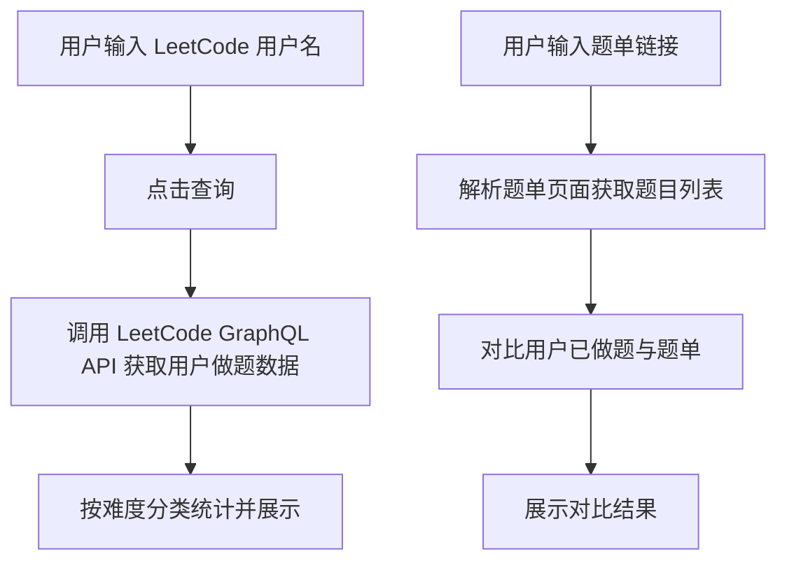

# LeetCode 题单追踪器 - 产品需求文档

## 1. 产品概述

一个简洁实用的 LeetCode 做题情况追踪工具，帮助用户查看个人做题统计数据，并与指定的题单进行对比，清晰展示哪些题目已完成、哪些尚未完成。

**目标用户**：准备技术面试的程序员、刷题学习者

**核心价值**：一目了然地了解自己的刷题进度与目标题单的差距

## 2. 核心功能

### 2.1 功能模块

1. **用户做题统计查询**
   - 输入 LeetCode 用户名
   - 按难度（简单/中等/困难）分类显示做题数量
   - 显示总做题数

2. **题单对比分析**
   - 输入题单链接（LeetCode 计划/列表页面）
   - 自动解析题单中的题目
   - 对比用户已做题与题单，分类展示：
     - 已完成：题目名称 + 状态标记
     - 未完成：以宋体显示「未做xxxx题单的第三题」格式
   - 展示题单完成进度百分比

3. **历史记录**
   - 保存最近查询的用户名和题单
   - 方便快速再次查看

### 2.2 页面设计

| 页面 | 模块 | 功能描述 |
|------|------|----------|
| 主页面 | 搜索区域 | 输入用户名和题单链接 |
| 主页面 | 统计卡片 | 展示用户做题数据（按难度分类） |
| 主页面 | 题单对比区 | 展示题单对比结果 |

## 3. 核心流程

### 3.1 用户查询流程



### 3.2 题单解析流程

1. 用户粘贴 LeetCode 题单链接
2. 系统解析链接获取题目 ID 列表
3. 调用 LeetCode GraphQL 获取题目详情（标题、难度）
4. 与用户已做题对比，生成未做题列表

## 4. 用户界面设计

### 4.1 设计风格

- **整体风格**：报纸排版风格，简洁、严肃、注重内容
- **配色方案**：
  - 背景色：`#FFFFFF`（纯白）
  - 主文字：`#000000`（纯黑）
  - 次要文字：`#666666`（深灰）
  - 边框/分割线：`#CCCCCC`（浅灰）
  - 强调色：`#1A1A1A`（近黑）
- **字体**：
  - 主字体：宋体（SimSun），强调标题使用黑体
  - 英文辅助：Georgia 或 Times New Roman
  - 等宽字体用于代码/题号
- **布局**：多栏报纸式布局，内容区域用细线分隔
- **图标**：无或极少，保持报纸风格

### 4.2 页面布局

```
┌─────────────────────────────────────────────────────────┐
│                      标题标题标题                          │
│                   LeetCode 题单追踪器                      │
├─────────────────────────────────────────────────────────┤
│  ┌─────────────────┐  ┌─────────────────────────────┐   │
│  │ 输入 LeetCode   │  │ 输入题单链接                  │   │
│  │ 用户名          │  │ https://leetcode.cn/...     │   │
│  └─────────────────┘  └─────────────────────────────┘   │
│                                                         │
│  [        查询按钮        ]                              │
├─────────────────────────────────────────────────────────┤
│  用户做题统计                                            │
│  ─────────────────────────────────────────────────────  │
│  总计: XX 题  │  简单: XX  │  中等: XX  │  困难: XX     │
├─────────────────────────────────────────────────────────┤
│  题单对比结果                                            │
│  ─────────────────────────────────────────────────────  │
│                                                         │
│  题单: xxxx                                             │
│  完成度: 2/10 (20%)                                     │
│                                                         │
│  ✓ 1. 两数之和                                          │
│  ✓ 2. 两数相加                                          │
│  ✗ 未做 xxxx 题单的第三题 - 三数之和                      │
│                                                         │
└─────────────────────────────────────────────────────────┘
```

### 4.3 响应式设计

- 桌面端：双栏或三栏布局
- 移动端：单栏堆叠布局，保持报纸排版风格

## 5. 技术说明

### 5.1 数据来源

- **LeetCode 用户数据**：使用 LeetCode GraphQL API（无需认证）
- **题单解析**：通过用户粘贴的链接，后端代理请求并解析页面内容

### 5.2 无需后端场景

如果题单链接格式为纯文本列表（每行一个题号），可完全前端实现。复杂页面解析需要轻量后端服务。

## 6. 边缘情况处理

| 场景 | 处理方式 |
|------|----------|
| 用户名不存在 | 显示「未找到该用户」提示 |
| 题单链接无效 | 显示「无法解析该链接」提示 |
| 网络请求失败 | 显示重试按钮，提示用户检查网络 |
| 题单为空 | 显示「该题单暂无题目」 |
| 用户未登录 LeetCode | 提示用户确认用户名是否正确 |
