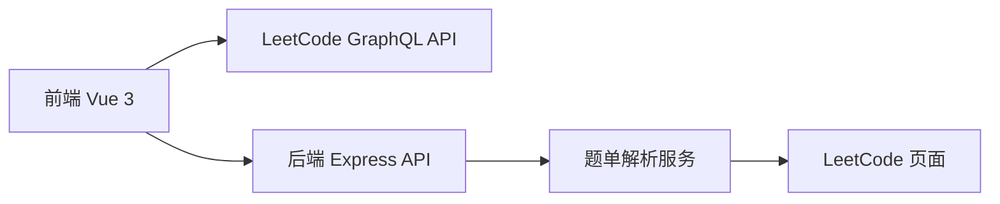

# LeetCode 题单追踪器 - 技术架构文档

## 1. 架构设计



**架构说明**：
- 前端：Vue 3 单页应用，直接调用 LeetCode 公开 GraphQL API
- 后端：Express 服务器，处理题单链接解析（CORS 代理 + HTML 解析）
- 数据流：用户输入 → 前端请求 → 后端解析 → 返回结果

## 2. 技术栈

| 层级 | 技术 | 说明 |
|------|------|------|
| 前端框架 | Vue 3 + Vite | 现代响应式框架 |
| UI 样式 | Tailwind CSS | 快速样式开发 |
| 后端 | Express 4 | 轻量 Node.js 服务器 |
| HTTP 客户端 | Axios | 前后端通信 |
| HTML 解析 | Cheerio | 后端解析题单页面 |
| 部署 | 前后端分离部署 | 前端静态托管 + 后端服务 |

## 3. 路由定义

### 3.1 前端路由

| 路径 | 页面 | 功能 |
|------|------|------|
| `/` | Home | 主页面，包含查询和结果展示 |

### 3.2 后端 API

| 路径 | 方法 | 功能 | 请求体 | 响应 |
|------|------|------|--------|------|
| `/api/parse-problem-list` | POST | 解析题单链接 | `{ url: string }` | `{ problems: [{id, title, difficulty}] }` |

## 4. API 详细定义

### 4.1 LeetCode GraphQL 查询（前端直接调用）

**端点**：`https://leetcode.cn/graphql`

**查询用户做题统计**：
```graphql
query userProblemsProgress($username: String!) {
  matchedUser(username: $username) {
    submitStats {
      acSubmissionNum {
        difficulty
        count
      }
    }
  }
}
```

**查询用户已做题目列表**：
```graphql
query userProblems($username: String!) {
  matchedUser(username: $username) {
    problemsSolvedBeatsStats {
      difficulty
      count
    }
    submitStatsGlobal {
      submissionNum
    }
  }
}
```

### 4.2 后端题单解析 API

**请求**：
```typescript
// POST /api/parse-problem-list
{
  "url": "https://leetcode.cn/problem-list/problems"
}
```

**响应**：
```typescript
{
  "success": true,
  "title": "题单标题",
  "problems": [
    { "id": "1", "title": "两数之和", "difficulty": "Easy" },
    { "id": "2", "title": "两数相加", "difficulty": "Medium" }
  ]
}
```

## 5. 数据模型

### 5.1 前端状态

```typescript
interface AppState {
  username: string;
  problemListUrl: string;
  userStats: {
    totalSolved: number;
    easySolved: number;
    mediumSolved: number;
    hardSolved: number;
  } | null;
  problemList: {
    title: string;
    problems: Problem[];
  } | null;
  comparison: {
    done: Problem[];
    notDone: Problem[];
    progress: number;
  } | null;
  loading: boolean;
  error: string | null;
}
```

### 5.2 Problem 类型

```typescript
interface Problem {
  id: string;        // 题目编号
  title: string;      // 题目标题
  difficulty: 'Easy' | 'Medium' | 'Hard';
}
```

## 6. 部署方案

### 6.1 前端部署

- 构建产物（dist 目录）部署到静态托管服务
- 配置 SPA 回退（所有路由指向 index.html）

### 6.2 后端部署

- Express 服务部署到 Node.js 托管环境
- 配置环境变量：`PORT`, `CORS_ORIGIN`

### 6.3 环境变量

```env
PORT=3000
CORS_ORIGIN=https://your-frontend-domain.com
```
